# 🧪 Lab 11 – Cartographie interactive avec MapLibreGL

Ce laboratoire vise à construire une application web de cartographie interactive en JavaScript avec MapLibreGL. L'objectif est de maîtriser la structure d'un projet carto web moderne en plusieurs fichiers.

---

## 📂 Architecture des fichiers
- `index.html` : page principale HTML
- `map-controls.js` : création et configuration de la carte
- `map-layers.js` : définition des sources et des couches
- `app.js` : injection dynamique des couches dans la carte
- `mouse-controls.js` : interactions souris (hover, clic, popup)

---

## 📊 ÉTAPE 1 – Faire rouler le server et Initialisation de la carte


📸 *Capture du processus
  
  
  
  
  


### 📄 Fichier : `map-controls.js`

1. Créer le fichier `map-controls.js`
2. Ajouter le code d'initialisation :
```js
var map = new maplibregl.Map({
  container: 'map',
  style: 'https://api.maptiler.com/maps/streets/style.json?key=VOTRE_CLE',
  center: [-73.56, 45.51],
  zoom: 11
});


var nav = new maplibregl.NavigationControl({ showCompass: true });
map.addControl(nav, 'top-right');

var geolocate = new maplibregl.GeolocateControl({
  positionOptions: { enableHighAccuracy: true },
  trackUserLocation: true
});
map.addControl(geolocate, 'bottom-right');

var scale = new maplibregl.ScaleControl({ unit: 'metric' });
map.addControl(scale);
```

📸 *Capture du processus
  
  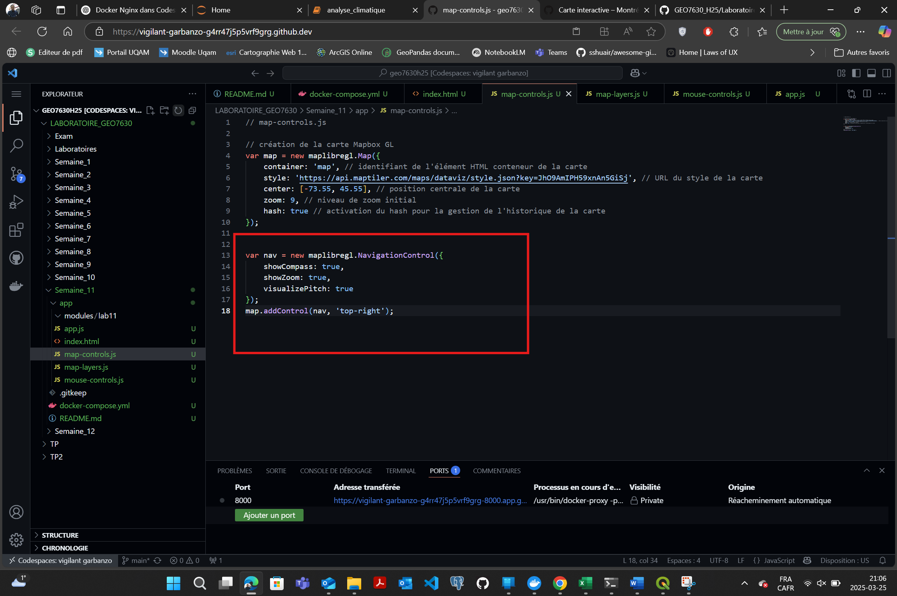
  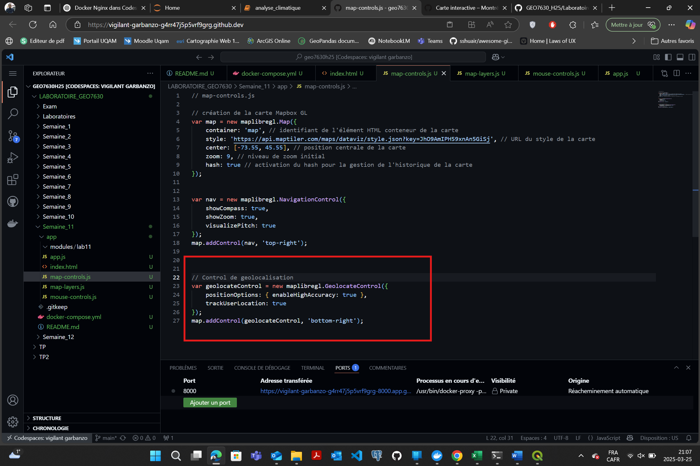
  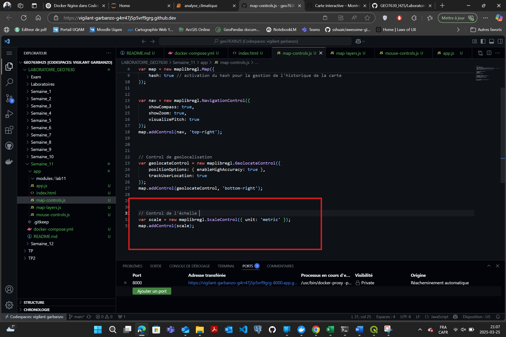
  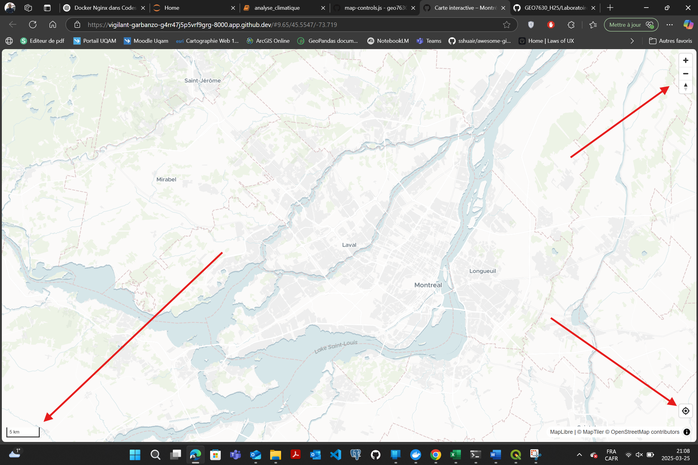

---

## 🏘️ ÉTAPE 2 – Ajout des couches de données

### 📄 Fichier : `map-layers.js`

#### Commerces (points)
```js
var commercesSource = {
  type: 'geojson',
  data: 'https://donnees.montreal.ca/dataset/c1d65779-d3cb-44e8-af0a-b9f2c5f7766d/resource/ece728c7-6f2d-4a51-a36d-21cd70e0ddc7/download/businesses.geojson'
};

var commercesLayer = {
  id: 'commerces',
  type: 'circle',
  source: 'commerces_source',
  paint: {
    'circle-radius': [
      'match', ['get', 'type'],
      'Épicerie', 5,
      'Pâtisserie/Boulangerie', 7,
      'Distributrice automatique', 4,
      'Pharmacie', 6,
      'Restaurant', 5,
      3
    ],
    'circle-color': [
      'match', ['get', 'type'],
      'Épicerie', 'orange',
      'Pâtisserie/Boulangerie', 'yellow',
      'Distributrice automatique', 'blue',
      'Pharmacie', 'green',
      'Restaurant', 'purple',
      'grey'
    ],
    'circle-stroke-color': '#fff',
    'circle-stroke-width': 1
  },
  filter: ['==', ['get', 'statut'], 'Ouvert']
};
```

#### Arrondissements (polygones)
```js
var arrSource = {
  type: 'geojson',
  data: 'https://special-train-.../collections/public.arrondissements/items?limit=5000'
};

var arrondissementsLayer = {
  id: 'arrondissements',
  type: 'fill',
  source: 'arrondissements-source',
  paint: {
    'fill-color': 'rgba(200,200,200,0.4)',
    'fill-outline-color': 'black'
  }
};

var arrondissementsLabel = {
  id: 'arrondissements-labels',
  type: 'symbol',
  source: 'arrondissements-source',
  layout: {
    'text-field': ['get', 'nom'],
    'text-font': ['Open Sans Bold', 'Arial Unicode MS Bold'],
    'text-size': 14,
    'text-anchor': 'center'
  },
  paint: {
    'text-color': '#111',
    'text-halo-color': '#fff',
    'text-halo-width': 1.5
  }
};
```


📸 *Capture du processus
  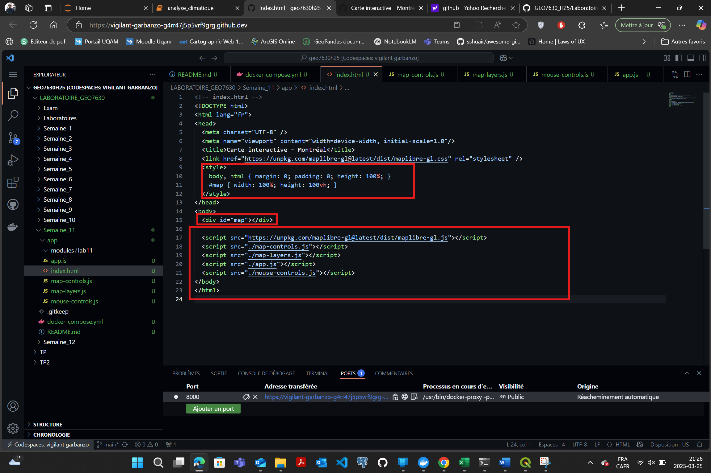
  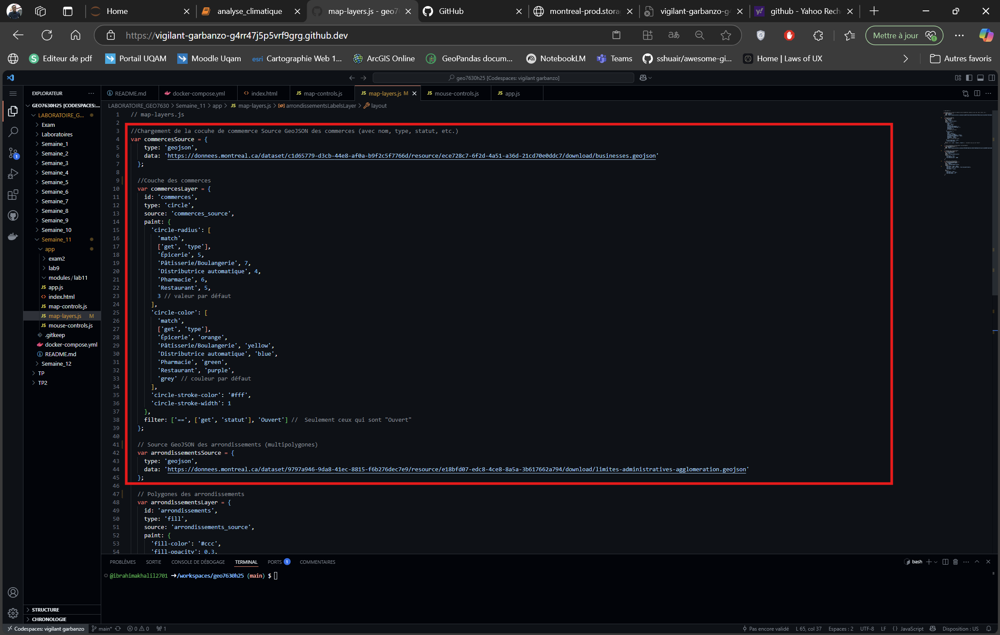
  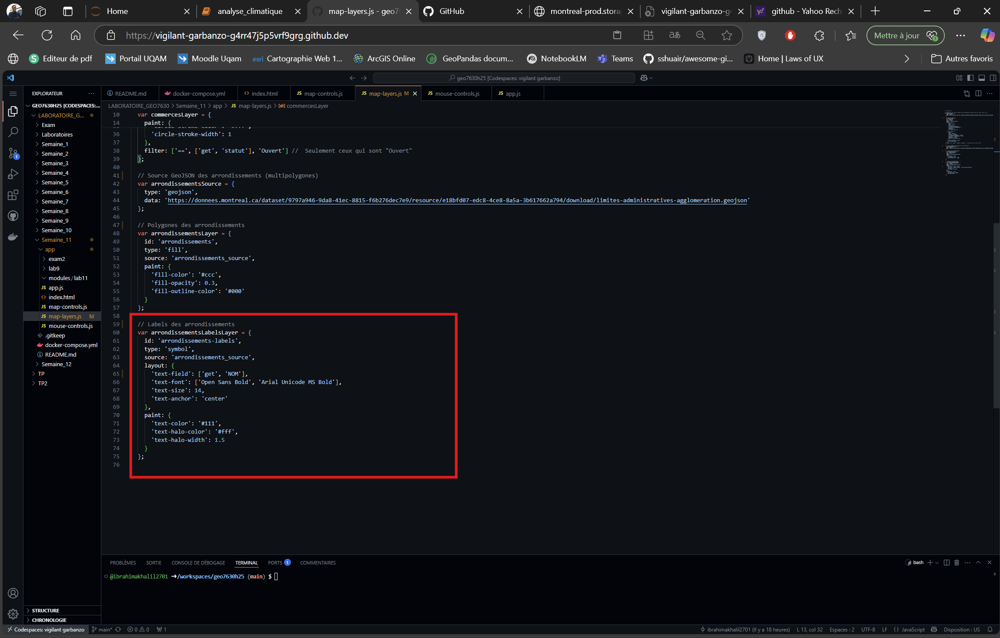
  
---

## 🚀 ÉTAPE 3 – Chargement dynamique des couches

### 📄 Fichier : `app.js`

```js
map.on('load', function () {
  map.addSource('commerces_source', commercesSource);
  map.addLayer(commercesLayer);

  map.addSource('arrondissements-source', arrSource);
  map.addLayer(arrondissementsLayer);
  map.addLayer(arrondissementsLabel);
});
```
📸 *Capture du processus
  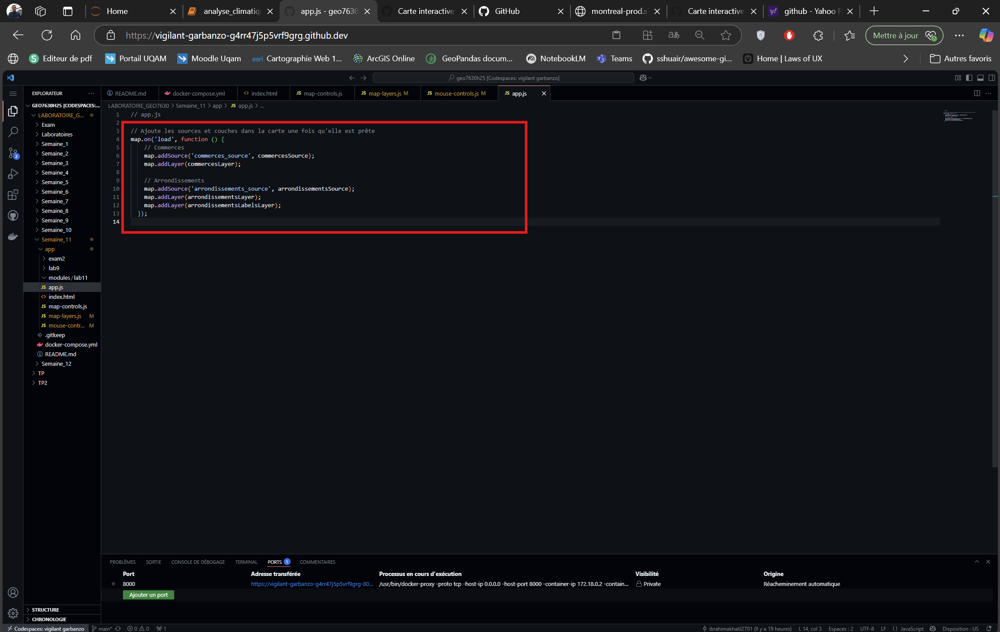
---

## 🚗 ÉTAPE 4 – Contrôles souris et interactions

### 📄 Fichier : `mouse-controls.js`

```js
map.on('mouseenter', 'commerces', () => {
  map.getCanvas().style.cursor = 'pointer';
});

map.on('mouseleave', 'commerces', () => {
  map.getCanvas().style.cursor = '';
});

map.on('click', 'commerces', (e) => {
  var coords = e.features[0].geometry.coordinates;
  var props = e.features[0].properties;

  new maplibregl.Popup()
    .setLngLat(coords)
    .setHTML(`<strong>${props.nom}</strong><br>Type : ${props.type}`)
    .addTo(map);

  map.flyTo({ center: coords, zoom: 14 });
});
```

📸 *Capture du processus
  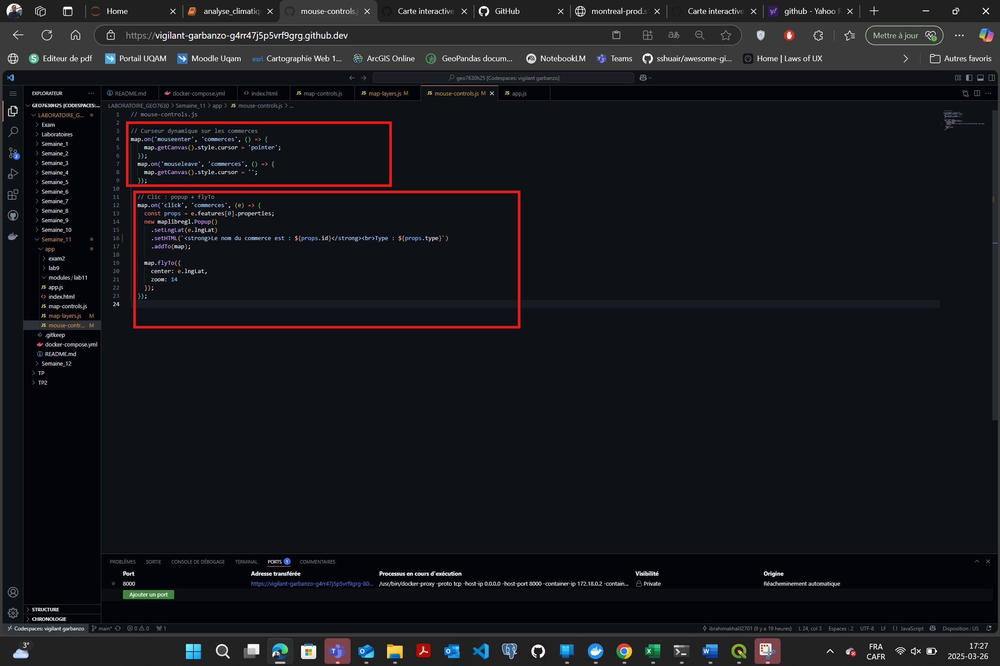

---


## 🔹 Résultat attendu

Une carte centrée sur Montréal avec :
- Points stylisés pour les commerces (filtrés sur "Ouvert")
- Polygones des arrondissements avec labels
- Interactions intuitives (hover, clic, popup)

📸 *Capture du processus
  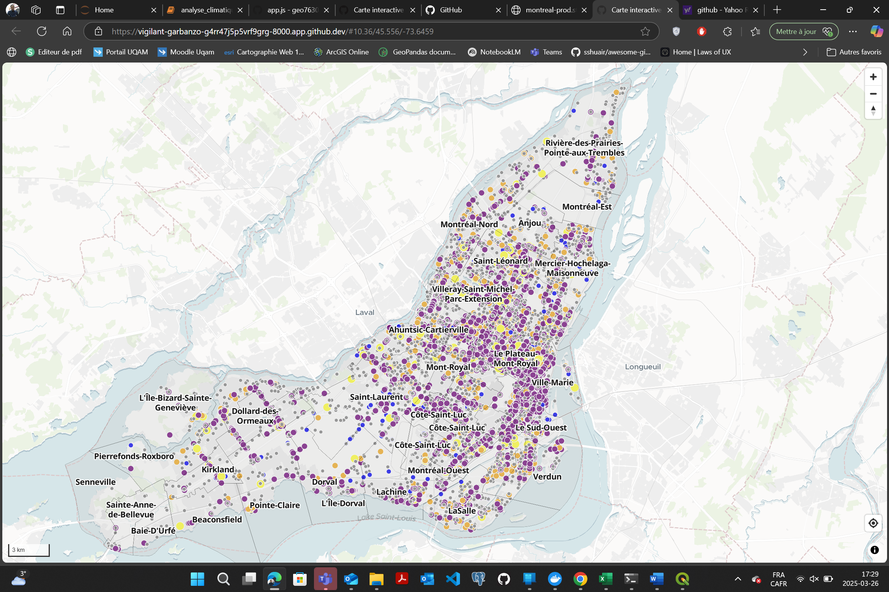
    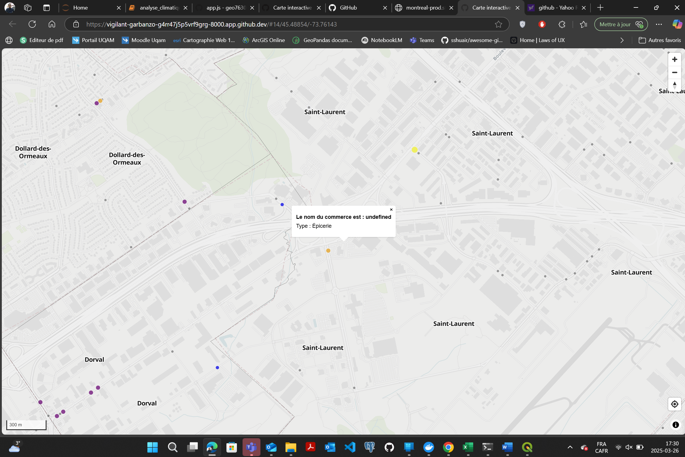


> Ce labo renforce mes compétences en cartographie web avec MapLibre, en gestion de couches et interactions.

