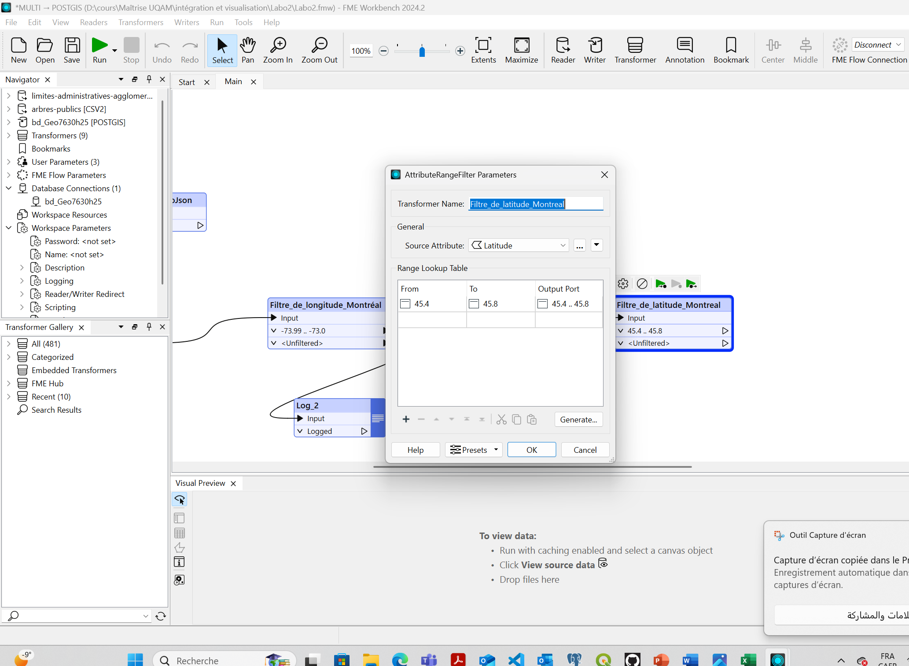
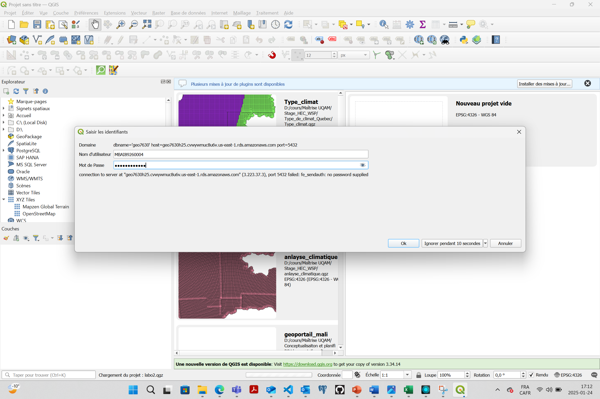

🌍 geo7630

# 📌 Projet :  Laboratoire 2 : Jointure et traitement des données géospatiales

Ce projet illustre l'utilisation de FME, PostgreSQL/PostGIS et QGIS pour importer, traiter et visualiser des données géospatiales.

---

## 🎯 Objectifs

- 🚀 Manipuler des données géospatiales plus complexes en combinant des données vectorielles et matricielles
- 🌐 Réaliser une jointure spatiale pour répondre à une problématique simple
- 🌐 Effectuer des analyses géospatiales statistiques avec FME.
- 🗺️ Visualiser les résultats dans QGIS avec une symbologie claire.

## Données 
- [Limites administratives de la ville de Montréal](limites-administratives-agglomeration-nad83.geojson)
- [Répartition des arbres dans la ville de Montréal](arbres-publics.csv)

Problématique : Identifier la répartition des arbres par quartier dans la ville de Montréal.

---

## 🛠️ Tâches Réalisées

1. 📄 Lecture du fichier CSV contenant des coordonnées géographiques (`CSV`, `GeoJSON`) dans FME.
2. ✏️ Effectuer un filtrage par longitude et latitude pour restreindre les données à la zone de Montréal.
3. ✏️ Croiser les points des arbres publics avec les limites administratives.
4. ✏️ Calculer des statistiques comme la densité d'arbres par quartier.
5. 🖥️ Exporter les données dans PostgreSQL/PostGIS.
6. 🌍 Visualiser les résultats dans QGIS avec une légende adaptée.

## 📚 Étapes de Réalisation

### 1️⃣ Lecture et préparation des fichiers
Les fichiers sources (CSV pour les arbres publics et GeoJSON pour les limites administratives) ont été chargés dans FME Workbench.

### Étape 2️⃣ : Projection des données
- Utilisez le Reprojector pour projeter les deux jeux de données en EPSG:32188 MTM8 :

### Étape 3️⃣ : Application des filtres dans FME

Utilisation des transformers AttributeRangeFilter pour filtrer les données de longitude et latitude correspondant à Montréal.
- Utilisation des filtres `AttributeRangeFilter` pour limiter les données des arbres publics aux coordonnées correspondant à la zone de Montréal.
- Exemple de filtre sur la longitude et la latitude :

### Étape 4️⃣ : Analyse spatiale, Jointure Spatiale, Superposition des points et calcul des densités

Utilisation du transformer PointOnAreaOverlayer pour associer chaque point (arbre) à un quartier.

Calcul de la densité des arbres par quartier avec AttributeCreator.
- Croisement des arbres publics et des quartiers avec le `PointOnAreaOverlayer` pour obtenir les informations de densité par quartier.

### Étape 5️⃣ : Nettoyage des attributs :

- Garder uniquement les attributs pertinents (ex. NOM).
- Utiliser le AttributeKeeper pour filtrer les colonnes inutiles.

### Étape 6️⃣ : Calcul de la densité d'arbres
- Création d'un attribut `densite_arbres` en divisant le nombre d'arbres par la surface des quartiers.
- Transformer utilisé : `AttributeCreator`.

### Étape 7️⃣ : Exportation vers PostgreSQL/PostGIS avec un writer 
- Les résultats sont exportés dans une table `densite_arbres_quartiers` dans PostgreSQL.
- Configuration du Writer pour PostGIS :

### Étape 8️⃣ : Visualisation dans QGIS
- Les données exportées sont visualisées dans QGIS avec une symbologie graduée pour représenter la densité des arbres.

---

## 📊 Résultats

🌿 Table PostgreSQL : La table contient les données des densités d'arbres par quartier.

🗺️ Carte Thématique : Une visualisation claire des densités dans QGIS.

## 🚀 Technologies Utilisées

FME : Pour le traitement et la transformation des données.

PostgreSQL/PostGIS : Pour le stockage et la gestion des données géospatiales.

QGIS : Pour la visualisation et la cartographie.

## ✍️ Auteur

Votre MBACKE IBRAHIMAKHLAIL en Géomatique à l'UQAM

