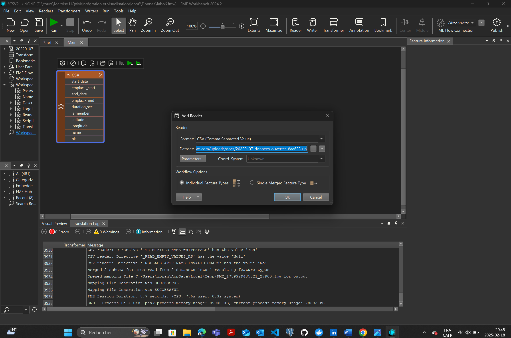

# 🛰 Laboratoire 6 et 7 : Intégration de données avec FME et ArcGIS Online

## 🔧 Prérequis
- Compte ArcGIS Online actif
- FME Workbench installé et configuré
- Accès aux outils : Map Viewer, Dashboard et Experience Builder d’Esri

---

## 📂 Chargement et préparation des données

### 📥 Étape 1 : Importation du CSV dans FME
- **Objectif** : Charger les données brutes de Bixi dans FME
- **Source** : `https://sitewebbixi.s3.amazonaws.com/uploads/docs/20220107-donnees-ouvertes-8aa623.zip`
- **Actions** :
  - Décompresser le fichier
  - Créer un nouveau Workbench
  - Ajouter un `CSV Reader` pour chaque fichier CSV du dossier

📸 *Capture du processus
  

### 🟢 Étape 2 : Nettoyage des données avec `AttributeFilter`
- **But** : Exclure les enregistrements sans coordonnées ou avec `-1` en longitude
- **Transformer utilisé** : `AttributeFilter`
  - Créer un filtre sur `longitude != -1`
  - Gérer les cas de stations mal géolocalisées

📸 *Capture suggérée : configuration de l'AttributeFilter avec conditions appliquées.*

### 📊 Étape 3 : Calcul des statistiques avec `StatisticsCalculator`
- **Objectif** : Calculer le total des arrivées et des départs par station
- **Transformers** :
  - `StatisticsCalculator` sur `emplacement_pk_end` → total des **arrivées**
  - `StatisticsCalculator` sur `emplacement_pk_start` → total des **dépôts**

📸 *Capture suggérée : statistiques configurées sur les ports appropriés.*

### ✏️ Étape 4 : Nettoyage des attributs avec `AttributeManager`
- Supprimer les attributs inutiles
- Renommer les champs (ex : `pk`, `start_total_count`, `end_total_count`)

📸 *Capture suggérée : aperçu de l'AttributeManager avec les renommages effectués.*

### 🔗 Étape 5 : Jointures des données avec `FeatureJoiner`
- **But** : Associer les données des départs et arrivées aux coordonnées des stations
- **Actions** :
  - 1er `FeatureJoiner` pour joindre **stations → départs** (clef = `pk`)
  - 2e `FeatureJoiner` pour joindre les **arrivées**
  - Nettoyage final avec `AttributeManager`

📸 *Capture suggérée : enchaînement des FeatureJoiners avec aperçu des sorties.*

---

## 💾 Exportation vers ArcGIS Online

### ✅ Création du Feature Service
- Se connecter à ArcGIS Online : [https://uqam.maps.arcgis.com](https://uqam.maps.arcgis.com)
- Créer un dossier `GEO7630`
- Utiliser un `ArcGIS Online Writer` dans FME
  - Dossier : `Geo7630h25`
  - Activer **CREATE IF NEEDED** pour permettre les mises à jour

📸 *Capture suggérée : Writer configuré avec service AGOL visible dans FME.*

---

## 🌍 Visualisation dans ArcGIS Online

### 🗺️ Étape 8 : Carte interactive (Map Viewer)
- Ouvrir le Feature Layer dans MapViewer
- Appliquer un style : “Comparer A à B” avec les champs `start_total_count` et `end_total_count`
- Ajouter des étiquettes : afficher A comme pourcentage de A et B
- Enregistrer la carte

📸 *Capture suggérée : Map Viewer avec les données stylisées.*

---

## 📊 Création du Dashboard

### 📋 Configuration de base
- Aller dans le menu d’applications > Dashboard
- Créer un nouveau tableau de bord dans le bon dossier
- Ajouter la carte précédemment créée
- Ajouter un **entête** (titre : "Stations de Bixi à Montréal")

📸 *Capture suggérée : vue d’ensemble du dashboard avec la carte intégrée.*

### ⚙️ Ajout d’éléments
- **Jauge 1** : Total des départs (`start_total_count`)
- **Jauge 2** : Total des arrivées (`end_total_count`)
- **Indicateur** : Ratio départ / arrivée :
```js
return {
  topText: 'Ratio départ / arrivée',
  topTextMaxSize: 'medium',
  middleText: Round($datapoint["SUM_start_total_count"] / $reference["SUM_end_total_count"], 3),
  middleTextMaxSize: 'large',
  noValue: false
}
```
- Activer la **référence** dans l’onglet Données de l’indicateur

📸 *Capture suggérée : configuration de l’indicateur dans ArcGIS Dashboard avec le script.*

### 🔢 Widget de total des stations visibles
- Ajouter un nouvel **indicateur** pour compter le nombre de stations affichées à l’écran

### 🧭 Légende et style
- Ajouter une **légende** en bas du tableau de bord
- Personnaliser le **thème** dans les réglages

📸 *Capture suggérée : aperçu de l’interface finale du Dashboard.*

---

## 🧠 Actions interactives
- Cliquer sur la **carte > Configurer > Actions sur la carte**
- Activer le **filtrage dynamique** pour tous les widgets

📸 *Capture suggérée : configuration des filtres dynamiques de la carte.*

---

## 🖼️ Rendu final attendu
- Une carte interactive avec clustering
- Deux jauges dynamiques : départs et arrivées
- Un indicateur de ratio
- Un compteur de stations visibles
- Une légende
- Un thème adapté

> Ce tableau de bord permet de visualiser la fréquentation des stations Bixi à Montréal, avec une lecture claire des départs, arrivées et écarts potentiels.

📸 *Capture suggérée : capture plein écran du tableau de bord final complet.*