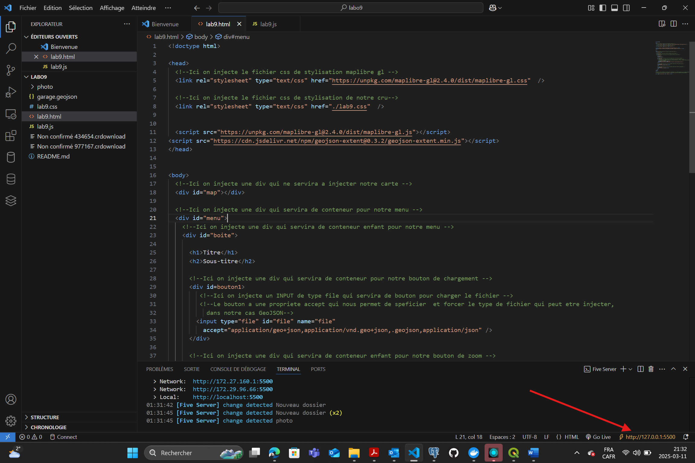
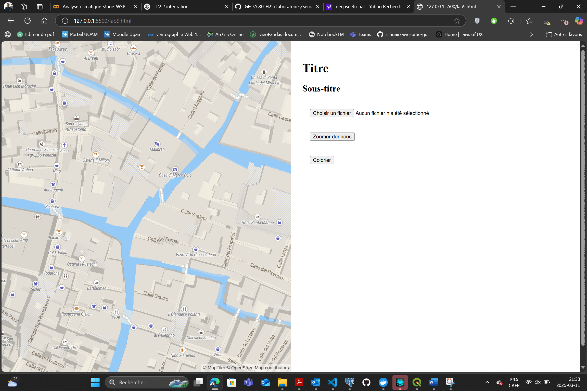
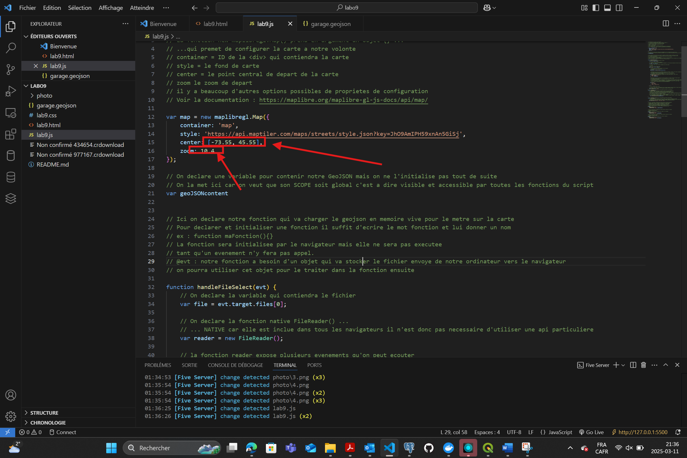

# 🛰️ GEO7630

# 📌 Projet : Laboratoire 9 : Webmapping Open Source avec MapLibreGL

Ce projet illustre la création d'une carte interactive avec MapLibreGL, en mettant en œuvre diverses fonctionnalités comme la personnalisation des couleurs, les coordonnées dynamiques, et l'ajout de symbologie thématique.

---

## 🎯 Objectifs
- Modifier des coordonnées et niveaux de zoom.
- Personnaliser les couleurs des polygones.
- Générer des couleurs aléatoires pour une symbologie dynamique.
- Ajouter des étiquettes dynamiques à une carte.
- Gérer la version de votre code avec Git/GitHub.

---

## ✏️ Tâches
1. Configurer votre projet initial avec GitHub.
2. Apporter des modifications aux coordonnées et au zoom.
3. Personnaliser les couleurs des polygones sur la carte.
4. Implémenter une génération de couleurs aléatoires.
5. Ajouter une symbologie thématique en fonction d’attributs.
6. Intégrer des étiquettes dynamiques.

---

## 🛠️ Outils utilisés
- **MapLibreGL** pour la visualisation cartographique.
- **JavaScript** pour les fonctionnalités dynamiques.
- **Git/GitHub** pour le contrôle de version.

---

## 📂 Étapes du projet

###  1. Configuration initiale et modification des coordonnées
- Modification des coordonnées

// Avant
center: [-73.55, 45.55], 
zoom: 10

// Après
center: [-73.60, 45.50], // Nouveau centre
zoom: 12 // Zoom renforcé

Résultat :
Carte centrée sur Montréal
- Processus :
  
  
  

### 1. Lecture du fichier CSV dans FME
