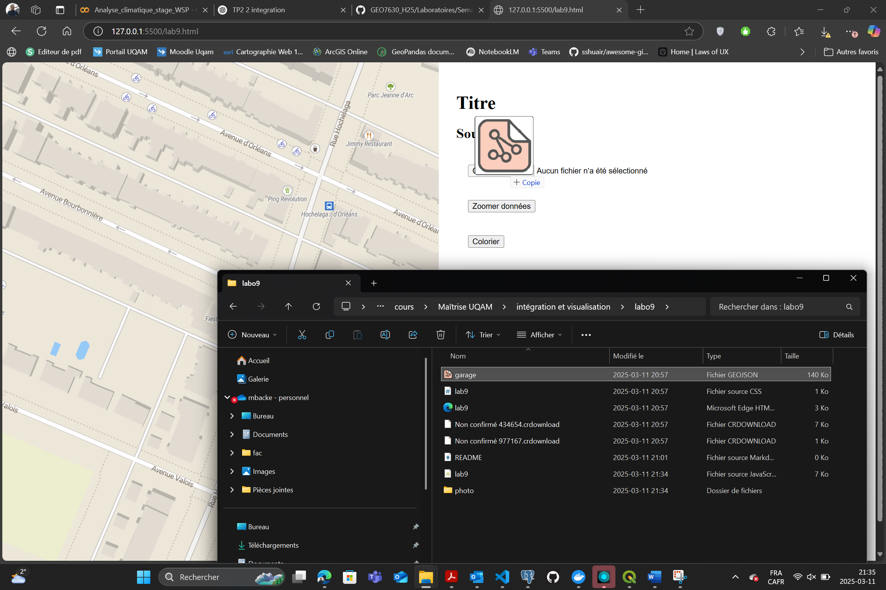
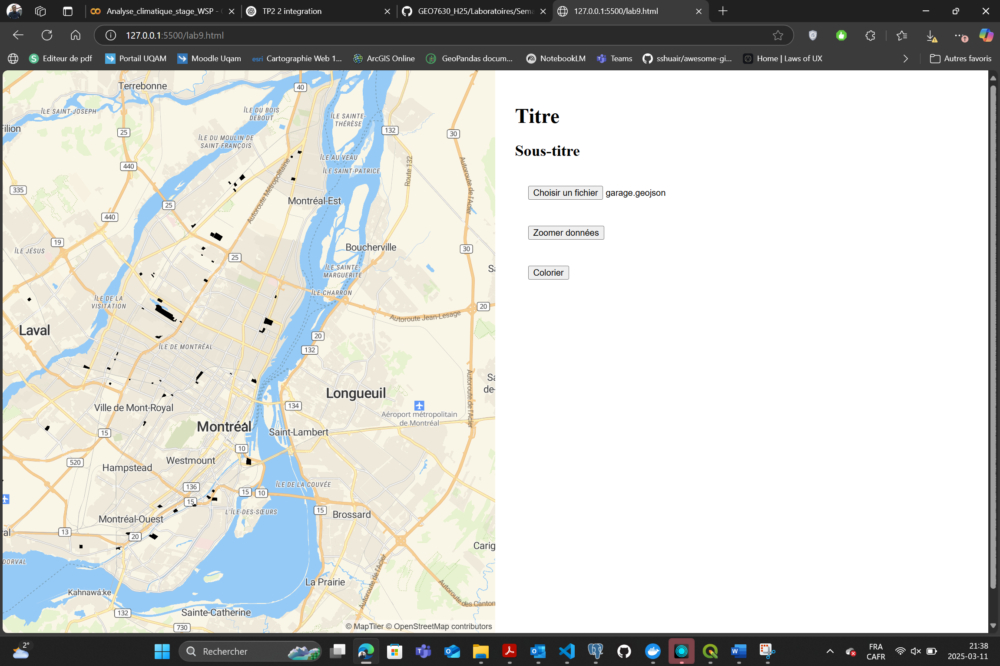
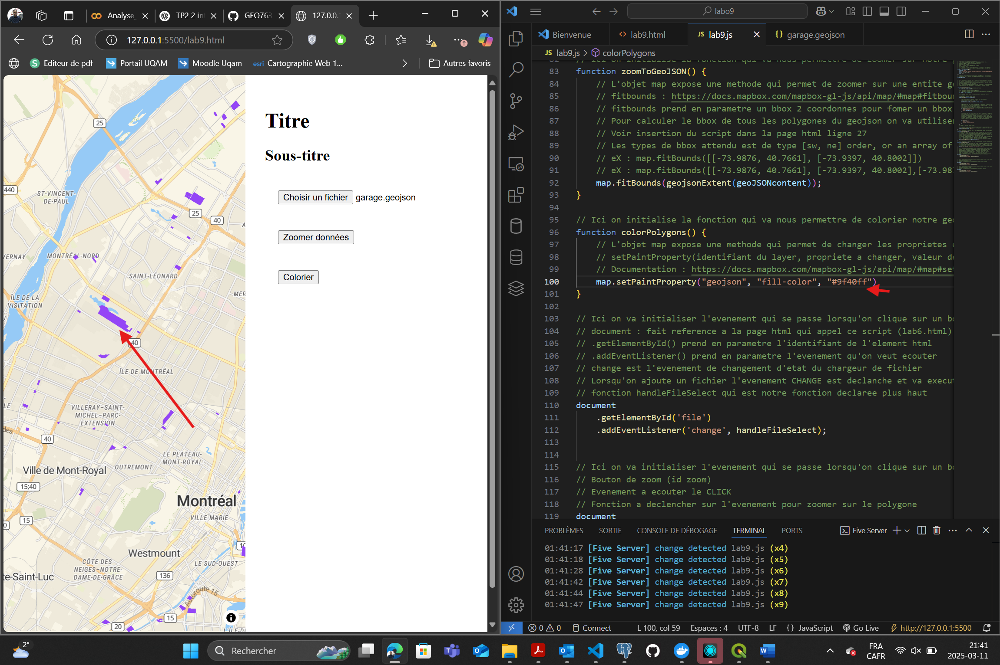
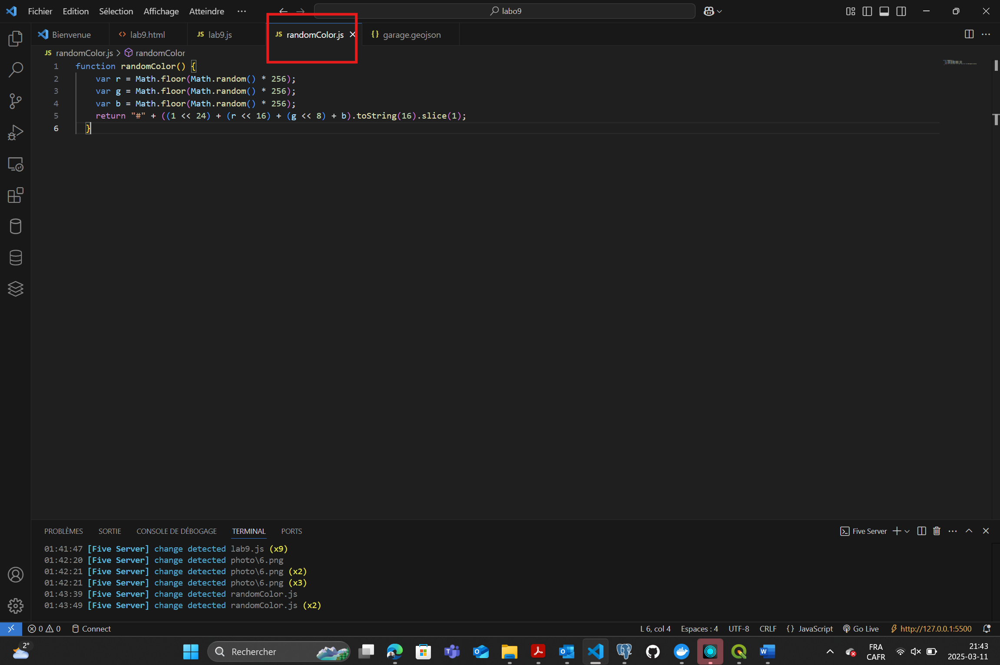
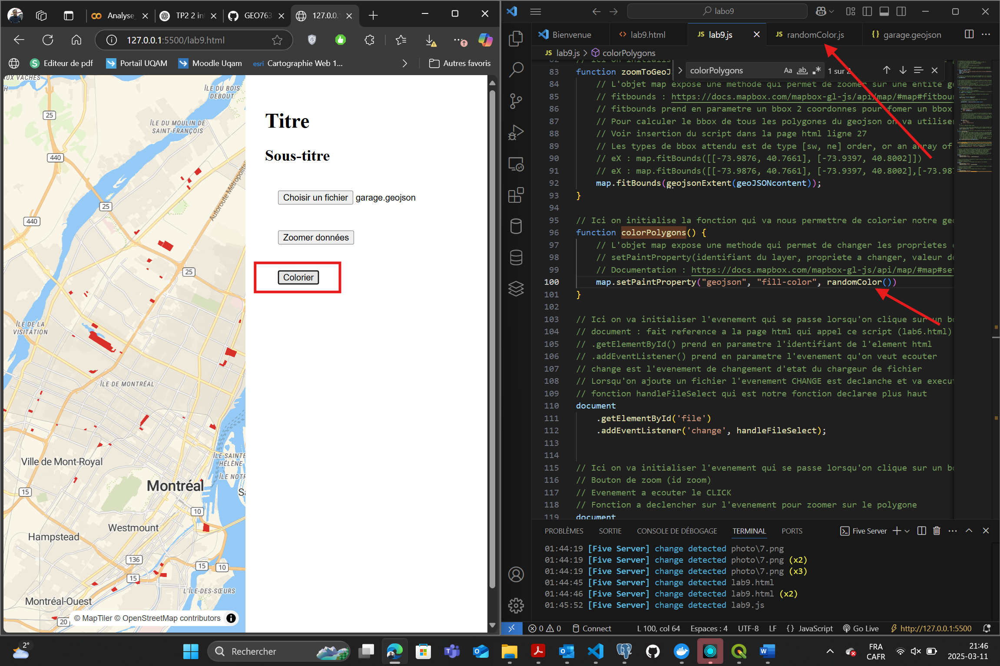
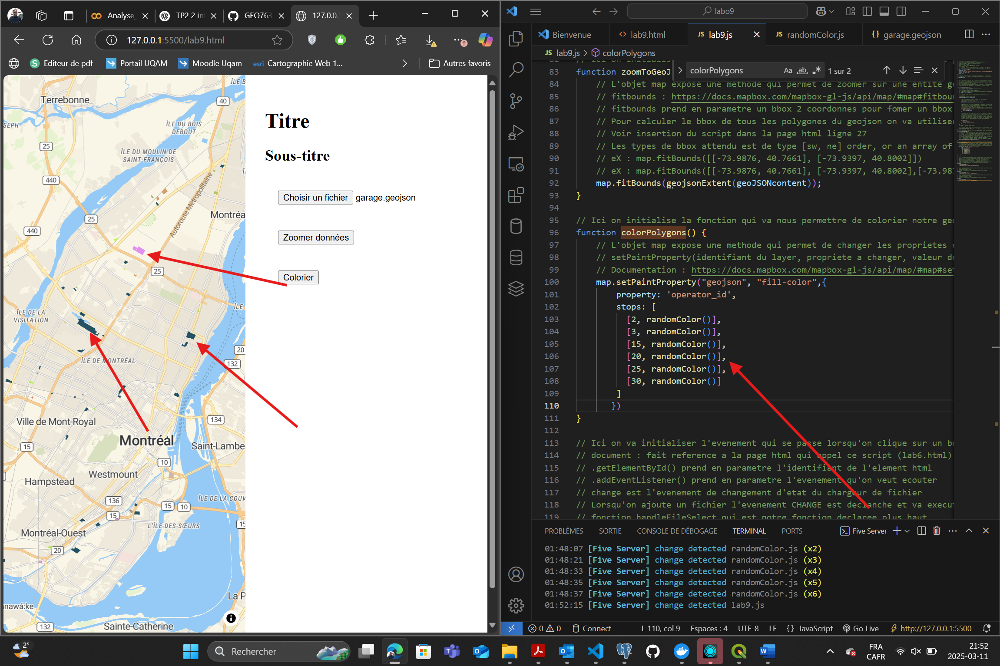
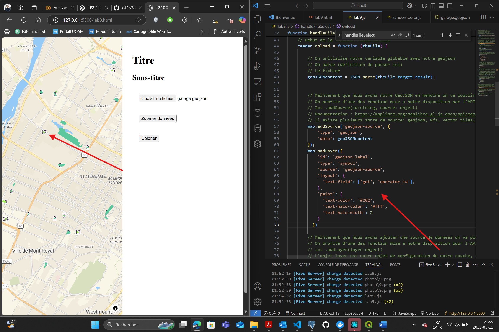

# 🛰️ GEO7630

# 📌 Projet : Laboratoire 9 : Webmapping Open Source avec MapLibreGL

Ce projet illustre la création d'une carte interactive avec MapLibreGL, en mettant en œuvre diverses fonctionnalités comme la personnalisation des couleurs, les coordonnées dynamiques, et l'ajout de symbologie thématique.

---

## 🎯 Objectifs
Ce laboratoire a pour but de se familiariser avec **MapLibreGL** et le **Webmapping Open Source**. apprends à :

- 🎯 Modifier les **coordonnées et le niveau de zoom** d’une carte.
- 🎨 **Personnaliser les couleurs** des polygones affichés.
- 🌈 Générer **des couleurs aléatoires** pour styliser les données.
- 🗺 Appliquer une **symbologie thématique** en fonction des attributs.
- 🔤 Ajouter **des étiquettes dynamiques** sur la carte.


---

## ✏️ Tâches
1. Configurer un projet initial avec GitHub.
2. Apporter des modifications aux coordonnées et au zoom.
3. Personnaliser les couleurs des polygones sur la carte.
4. Implémenter une génération de couleurs aléatoires.
5. Ajouter une symbologie thématique en fonction d’attributs.
6. Intégrer des étiquettes dynamiques.

---

## 🛠️ Outils utilisés
- **MapLibreGL** pour la visualisation cartographique.
- **JavaScript** pour les fonctionnalités dynamiques.
- **Git/GitHub** pour le contrôle de version.

---

## 📂 Étapes du projet

###  1. Configuration initiale et modification des coordonnées
Dans ce premier exercice, nous allons modifier le centre de la carte et ajuster son niveau de zoom.
- Modification des coordonnées


```javascript
// Avant
center: [-73.55, 45.55], 
zoom: 10

// Après
center: [-73.60, 45.50], // Nouveau centre
zoom: 12 // Zoom renforcé

```


🔹 Résultat attendu :
La carte est maintenant centrée sur Montréal avec un niveau de zoom plus détaillé.
- Processus :
  - Lecture du fichier
  - Lecture du fichier
  - Modification des coordonnées et du niveau de zoom
  - chargement des garages pour tester
  - le resulat
  


### 2. Personnalisation des couleurs
Nous allons maintenant changer la couleur des polygones affichés sur la carte.


```javaScript 

// Avant :

function colorPolygons() {
  map.setPaintProperty('garages-layer', 'fill-color', '#FF0000');
}
//Après :

function colorPolygons() {
  map.setPaintProperty('garages-layer', 'fill-color', '#9f40ff');
} 
```

🔹 Résultat attendu :
- Processus :
  - La couleur des polygones a changé en violet


### 3. Génération de couleurs aléatoires
Pour éviter d’avoir une seule couleur statique, nous allons implémenter une fonction générant des couleurs aléatoires.

 - 📌 Fichier à créer : randomColor.js

Ajouter le code suivant :

```JavaScript
function randomColor() {
  const r = Math.floor(Math.random() * 256);
  const g = Math.floor(Math.random() * 256);
  const b = Math.floor(Math.random() * 256);
  return `#${(1 << 24 | r << 16 | g << 8 | b).toString(16).slice(1)}`;
}

```
Ensuite, nous allons intégrer cette fonction dans labo9.html pour qu’elle puisse être utilisée par notre carte :

```HTML
<!-- Ajout dans index.html -->
<script src='./randomColor.js'></script>

```

🔹 Résultat attendu :
- Processus :
  - Création du fichier randomColor.js.
  - Les polygones affichés sur la carte auront des couleurs différentes à chaque chargement.


### 4. Symbologie thématique
Nous allons maintenant appliquer une couleur différente en fonction des valeurs d’un attribut (ex: operator_id).

- 📌 Fichier à modifier : lab9.js

Ajouter le code suivant pour colorer chaque polygone selon sa valeur operator_id :

```JavaScript

map.setPaintProperty('garages-layer', 'fill-color', {
  property: 'operator_id',
  stops: [
    [2, randomColor()],
    [3, randomColor()],
    [15, randomColor()],
    [20, randomColor()],
    [25, randomColor()],
    [30, randomColor()]
  ]
});

```

🔹 Résultat attendu :
- Processus :
  - Les polygones auront des couleurs différentes en fonction de leurs attributs..


### 5. Ajout d'étiquettes dynamiques
Nous allons maintenant ajouter des étiquettes dynamiques basées sur l’attribut operator_id.

- 📌 Fichier à modifier : lab9.js

Ajouter le code suivant :

```JavaScript
map.addLayer({
  'id': 'geojson-label',
  'type': 'symbol',
  'source': 'geojson-source',
  'layout': {
    'text-field': ['get', 'operator_id']
  },
  'paint': {
    'text-color': '#202',
    'text-halo-width': 2
  }
});

```
🔹 Résultat attendu :
- Processus :
   - Chaque polygone affiche désormais un numéro représentant son operator_id.


# 📂 Structure du Projet : Semaine_9

Ce dossier contient les fichiers nécessaires pour le laboratoire 9.

---

## 📁 Contenu du dossier

```plaintext
Semaine_9/
├── labo9.html         # Fichier principal de l'interface utilisateur
├── lab9.js            # Script JavaScript pour les fonctionnalités principales
├── randomColor.js     # Script JavaScript pour la génération de couleurs aléatoires
├── labo9.css          # Feuille de style CSS pour la mise en page
├── README.md          # Documentation du projet
├── garage.geojson     # Fichier GeoJSON contenant des données géospatiales

