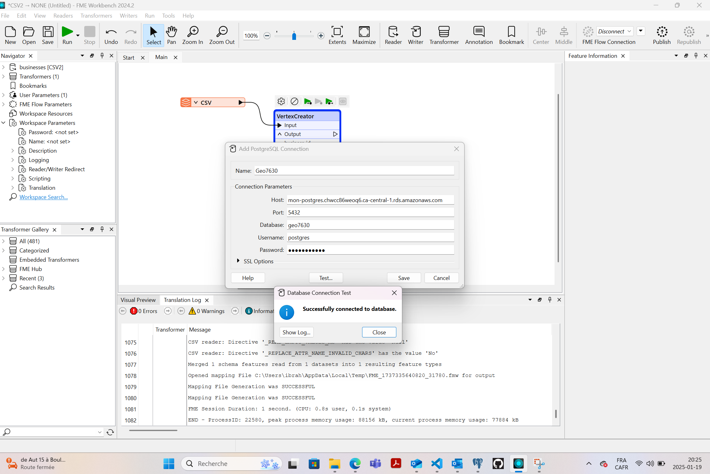

# geo7630
# Projet : Importation et Visualisation de Données Géospatiales

Ce projet illustre le processus d'importation d'un fichier contenant des coordonnées géographiques (X, Y) dans une base de données PostgreSQL/PostGIS, et la visualisation des données dans QGIS.

## Étapes du projet

### 1. Lecture du fichier SSV dans FME
- Fichier source : [Lien vers le fichier CSV](https://donnees.montreal.ca/dataset/c1d65779-d3cb-44e8-af0a-b9f2c5f7766d/resource/28a4957d-732e-48f9-8adb-0624867d9bb0/download/businesses.csv)
- Capture d’écran :
  
  

### 2. Conversion des coordonnées en géométrie (VertexCreator)
- Utilisation de **VertexCreator** pour créer des points géographiques.
- Capture d’écran :
  
  
  

### 3. Envoi des données vers PostgreSQL
- Configuration du Writer dans FME pour PostgreSQL À savoir j'ai utilisé ma base de donnée postgres, car, celui donnée dans le cours ne marchait pas pour moi.
- Capture d’écran :
  
  
  
  
  
  
  
  

### 4. Visualisation dans QGIS
- Connexion à la base PostgreSQL dans QGIS.
- Configuration de la symbologie.

- Capture d’écran :
  
  
  

## Résultat final
Les données géospatiales de Montréal sont maintenant importées dans PostgreSQL et visualisées avec succès dans QGIS.
