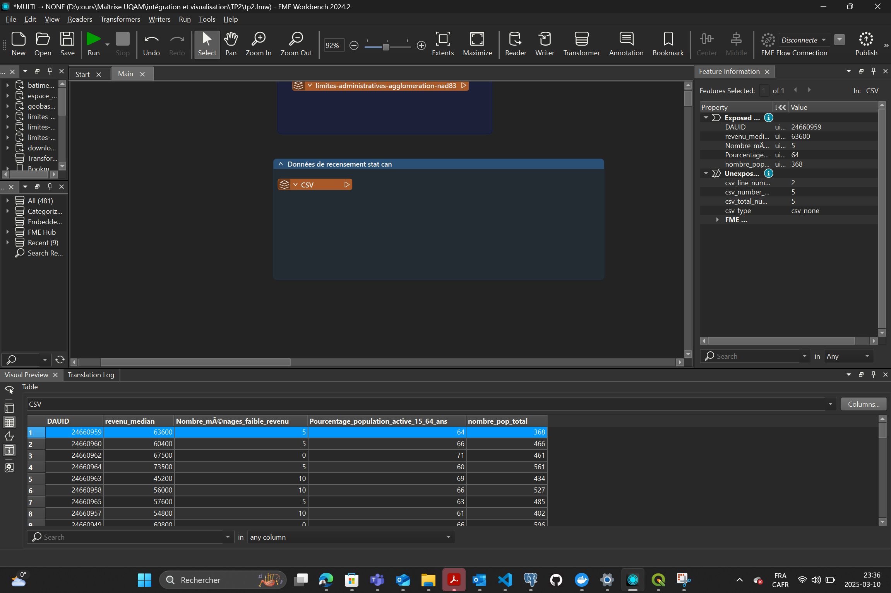
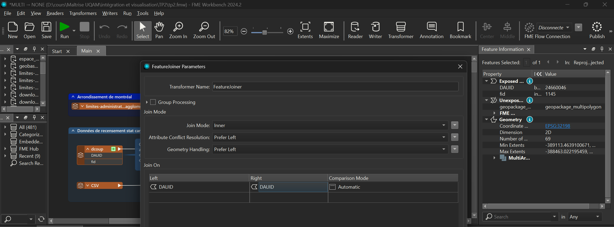

# Processus de traitement des données avec FME

Ce projet consiste à traiter des données géospatiales et statistiques pour produire des résultats exploitables. Les étapes suivantes décrivent le flux de travail réalisé dans FME (Feature Manipulation Engine).

---


## 🛠️ Le schéma explicatif
- ## 📊 Schéma du Processus de Données

Voici le schéma expliquant le flux de travail utilisé dans ce projet :


## Étape 1 : Chargement des données

### Sources de données
- 🗺 **`limites-administratives-agglomeration-nad83.geojson`**  
  Fichier GeoJSON des limites administratives (NAD83).  
   
  


- 📊 **`stat_can2021_recensement.csv`**  
  Données de recensement 2021 de Statistique Canada.  
  
  

- 🔷 **`decoup.shp`**  
  Shapefile des aires de diffusion (DA).  
  


### Connexion des sources
Les données sont chargées et dirigées vers l'étape de **Reprojection (EPSG:32198)**.

---

## Étape 2 : Transformations

### 🔄 Reprojection (NAD83 → Web Mercator)
- **Reprojector**  
  Les données géospatiales sont reprojetées du système de coordonnées NAD83 vers Web Mercator (EPSG:32198).
  
  

### 🔗 Jointure DAUID **`données des aires de diffusion et csv`**  
- **FeatureJoiner**  
  Une jointure interne (Inner Join) est effectuée entre les données géospatiales (Aires de diffusion) et les données statistiques du fichier CSV. La clé de jointure est l'identifiant DAUID.

  
  

### 🧹 Nettoyage des données

1. **AttributeManager**  
   Les attributs sont renommés pour une meilleure lisibilité (exemple : `revenu_median`).

     
     
     


2. **AttributeManager**  
   Pour nettoyer la cocuhes des limites administrative de la ville de Montréal pour ne garder que les colonnes importantes.

     
     
     
     


3. **NullAttributeMapper**  
   Les valeurs nulles (NULL) sont remplacées par des zéros (0) pour éviter les erreurs de calcul.

     
     
     
     


4. **Logger**  
   Un suivi des erreurs est mis en place pour identifier les problèmes potentiels dans les données.

### 🗺 Jointure Spatiale des deux entre les limites administratives et les aires de difussions pour placer chaque aires de diffusion dans son arrondissement pour des comparaisons ensuite
- **SpatialFilter**  
  Une jointure spatiale est effectuée pour filtrer les données en fonction de leur intersection avec les limites des arrondissements.

     
     

---

## Étape 3 : Calculs

### Calculs des indicateurs
1. **StatisticsCalculator**  
   La somme de la population est calculée pour chaque arrondissement.

   
   
   
   


2. **AttributeManager**  
   Enauite, on a utilisé un attributManger pour nettoyer encore renommer la colonne nombre de pop par arrondissement et supprimer la colonnes predicate inutile.
    
    


---

## Étape 4 : Export des résultats

Les données traitées sont exportées dans la bd pour une visualisatin dans QGIS :

1. 🐘 **PostGIS Writer**  
   Les données sont stockées dans une table PostgreSQL/PostGIS nommée `Table 1 à modifier plus tard par manque d'accès à la bd pour modifier`.

2. 🌐 **GeoJSON Writer**  
   Les données sont exportées au format GeoJSON.

   


---

## Résultat final
Le processus génère des données géospatiales et statistiques nettoyées, enrichies et prêtes à être utilisées dans des analyses ou des visualisations cartographiques.

## Présentation des deux cartes QGIS

### 1. Enregistrer le style de la couche


Cette première capture d’écran montre la fenêtre **"Enregistrer le style de la couche"** dans QGIS.  
- Elle permet de **sauvegarder la symbologie** (couleurs, classification, etc.) au format `.qml` (QGIS Layer Style) ou `.sld` (Styled Layer Descriptor).  


### 2. Carte stylisée : Densité de population par aire de diffusion et Arrondissement


La deuxième capture d’écran illustre la **carte finale** dans QGIS, avec :
- Un **rendu gradué** allant du **bleu clair** (densité plus faible) au **bleu foncé** (densité plus élevée).    
- Chaque polygone représente une **Aires de diffusion de StatCan**, et la couleur reflète la valeur de **population**.


## 🏗️ Architecture du Projet

```plaintext
TP2/
├── data/                 # Données d'entrée et de sortie
│   ├── aire_de_diffusion.gpkg
│   ├── limites-administratives-agglomeration-nad83.geojson
│   └── stat_can2021_recensement.csv
├── fme/                  # Scripts et traitements FME
│   └── tp2.fmw
├── image/                # Captures d'écran et images du projet
├── qgis/                 # Projet QGIS
│   └── TP2.qgz
└── README.md             # Documentation du projet


