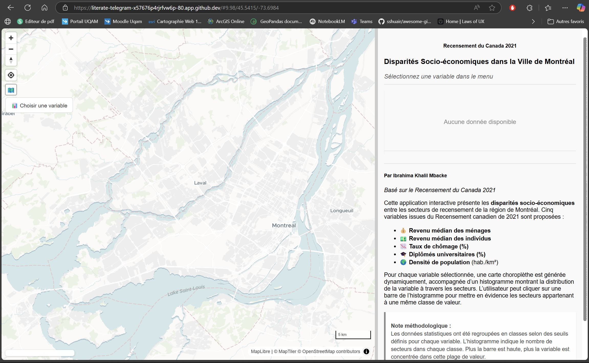
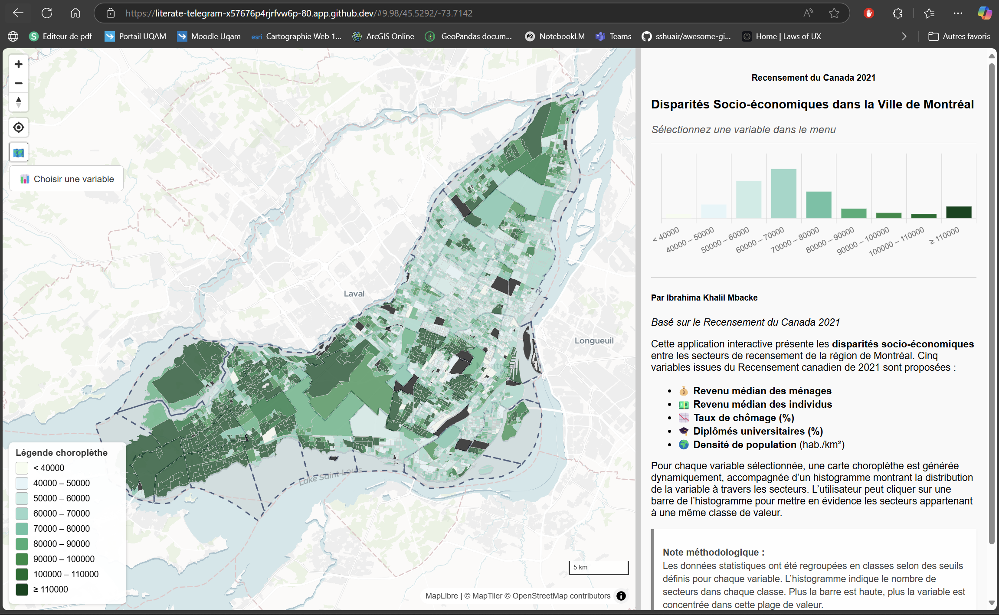
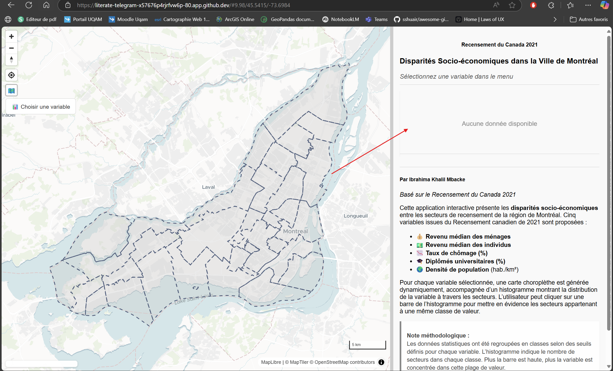
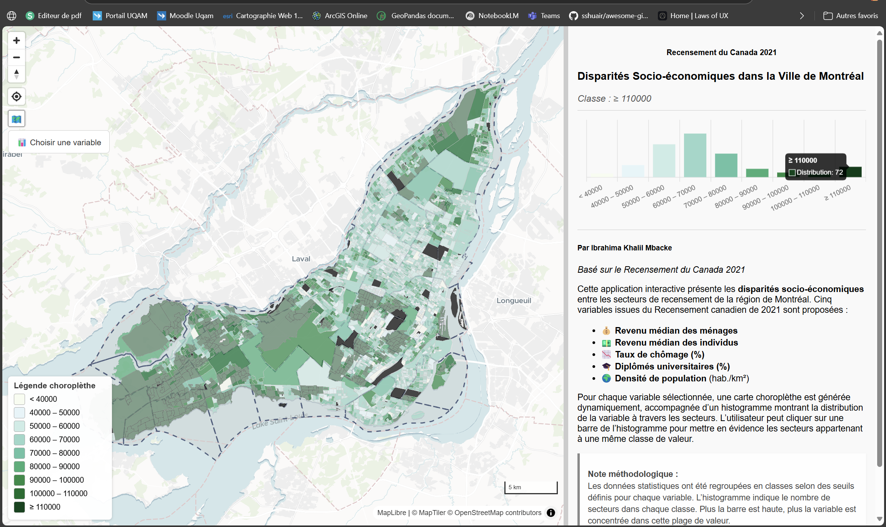
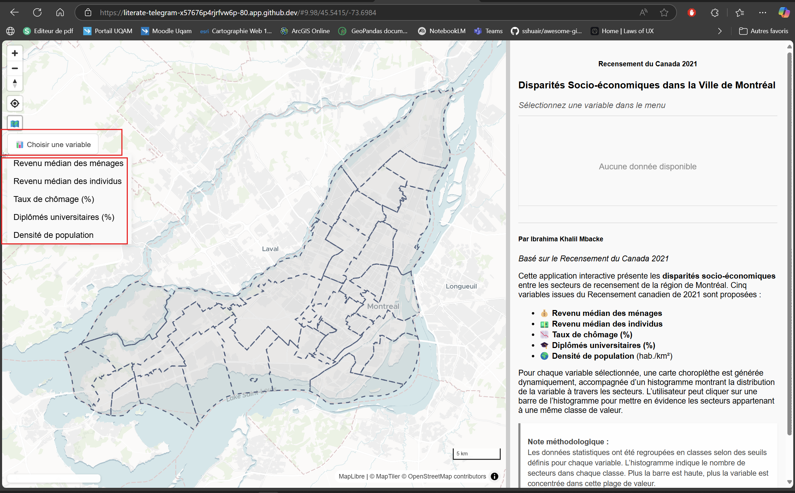

# Disparités Socio-Économiques - Équipe 1

Ce projet, réalisé dans le cadre d'un TP3 de GEO7630, présente une application web interactive qui visualise les disparités socio-économiques à Montréal en se basant sur les données du Recensement du Canada 2021. L'application affiche une carte choroplèthe et un histogramme interactif permettant d'analyser différentes variables statistiques.

## Table des matières

- [Objectifs du projet](#objectifs-du-projet)
- [Structure du projet](#structure-du-projet)
- [Fonctionnalités](#fonctionnalités)
- [Instructions d'utilisation](#instructions-dutilisation)
- [Démonstration visuelle](#démonstration-visuelle)
- [Technologies utilisées](#technologies-utilisées)
- [Conclusion](#conclusion)

## Objectifs du projet

- **Visualisation interactive :** Utiliser [MapLibre GL](https://maplibre.org) pour afficher une carte interactive.
- **Analyse statistique :** Créer un histogramme dynamique avec [Chart.js](https://www.chartjs.org) pour montrer la distribution des variables.
- **Sélection de variables :** Permettre à l'utilisateur de choisir parmi plusieurs variables socio-économiques issues du Recensement du Canada 2021 via un menu déroulant.
- **Interaction utilisateur :** Mettre en évidence sur la carte les secteurs correspondant à une classe de valeur lorsqu'une barre de l'histogramme est sélectionnée.
- **Architecture modulaire :** Organiser le code en modules JavaScript pour une meilleure maintenabilité.

## Structure du projet


/Equipe1
├── index.html           # Fichier HTML principal de l'application
├── app.css              # Feuille de style personnalisée
├── map-init.js          # Initialisation de la carte MapLibre et ajout des contrôles/Split.js
├── chart-init.js        # Création et configuration de l'histogramme avec Chart.js et son plugin "No Data"
├── data-loader.js       # Chargement des données GeoJSON et MVT, ajout des sources et couches à la carte
├── choropleth.js        # Gestion de la couche choroplèthe, mise à jour de l'histogramme, légende et filtrage (highlight)
├── dropdown.js          # Remplissage du menu déroulant et gestion des interactions sur l'histogramme
└── variables.js         # Variables globales et constantes (palettes de couleurs, libellés, seuils)
Fonctionnalités
Carte interactive : Affiche une carte avec un fond vectoriel (MapTiler).

Panneau latéral : Comprend l'histogramme, du texte explicatif et une légende dynamique.

Menu déroulant : Permet de sélectionner une variable parmi :

💰 Revenu médian des ménages

💵 Revenu médian des individus

📉 Taux de chômage (%)

🎓 Diplômés universitaires (%)

🌍 Densité de population (hab./km²)

Interaction sur l'histogramme : Un clic sur une barre de l'histogramme met en évidence sur la carte les secteurs appartenant à l'intervalle correspondant.

Affichage/masquage : Bouton permettant d'afficher ou de masquer la couche des arrondissements.

Instructions d'utilisation
Prérequis
Navigateur récent supportant les modules ES6 (Chrome, Firefox, Edge, etc.).

Connexion Internet pour charger les bibliothèques externes (MapLibre GL, Chart.js, Split.js).

Lancement de l'application
Télécharger le projet :
Clonez ou téléchargez le dépôt contenant tous les fichiers (index.html, app.css, app.js et le dossier js/).

Servir le projet localement :
Pour un fonctionnement optimal, utilisez un serveur local ou docker :


Utilisation :

La carte interactive s’affiche à gauche et le panneau latéral à droite.

Sélectionnez une variable dans le menu déroulant pour mettre à jour la carte et l'histogramme.

Cliquez sur une barre de l'histogramme pour mettre en évidence les secteurs correspondants.

Utilisez le bouton pour afficher/masquer la couche des arrondissements.

Démonstration visuelle
Interface principale

Capture d'écran montrant l'activation et la désactivation de la couches des arrondissements.

Capture d'écran montrant la carte interactive et le panneau latéral avec l'histogramme, le texte explicatif et la légende.




Capture d'écran montrant l'activation et la désactivation de la couches des arrondissements.



Menu déroulant

Capture d'écran du menu permettant de sélectionner une variable.


Interaction avec l'histogramme

Capture d'écran montrant la mise en évidence des secteurs sur la carte suite à un clic sur l'histogramme.




Explication du code
Voici un aperçu des principaux fichiers et de leurs responsabilités :

map-init.js
Fonctionnalité : Initialise la carte MapLibre avec un style, un centre, un zoom et ajoute des contrôles (navigation, géolocalisation, échelle).

Extrait de code :

```js
export function initMap() {
  map = new maplibregl.Map({
    container: 'map',
    style: 'https://api.maptiler.com/maps/dataviz/style.json?key=YOUR_KEY',
    center: [-73.68, 45.55],
    zoom: 9,
    hash: true
  });
  // Ajout des contrôles et configuration de Split.js
  ...
}```

chart-init.js
Fonctionnalité : Configure et crée l'histogramme avec Chart.js ainsi qu'un plugin personnalisé pour afficher un message lorsqu'aucune donnée n'est disponible.

Extrait de code :


```js
export function initMap() {
  map = new maplibregl.Map({
    container: 'map',
    style: 'https://api.maptiler.com/maps/dataviz/style.json?key=YOUR_KEY',
    center: [-73.68, 45.55],
    zoom: 9,
    hash: true
  });
  // Ajout des contrôles et configuration de Split.js
  // ...
}


Extrait de code :

js
Copier
export function loadData() {
  map.on('load', () => {
    fetch('URL_GEOJSON_ARRONDISSEMENTS')
      .then(res => res.json())
      .then(data => { ... });
    // Ajout des sources MVT et chargement des statistiques
    ...
  });
}
choropleth.js
Fonctionnalité : Gère la mise à jour de la couche choroplèthe, l'interaction avec l'histogramme, la mise à jour de la légende et le filtrage des données lors de la sélection.

Extrait de code :

js
Copier
export function updateChoropleth(variable) {
  // Si la même variable est sélectionnée, réinitialiser
  if (currentVariable === variable) { ... }
  // Sinon, configurer la nouvelle variable et mettre à jour la carte
  ...
}
dropdown.js
Fonctionnalité : Génère le menu déroulant des variables et attache les événements pour mettre à jour la carte lorsque l'utilisateur clique sur une option.

Extrait de code :

js
Copier
export function initDropdown() {
  const dropdown = document.getElementById("variableDropdown");
  Object.entries(variableLabels).forEach(([key, label]) => {
    const option = document.createElement("a");
    option.textContent = label;
    option.href = "#";
    option.onclick = (e) => { e.preventDefault(); updateChoropleth(key); };
    dropdown.appendChild(option);
  });
}
variables.js
Fonctionnalité : Stocke les variables globales et constantes utilisées dans le projet (identifiants des couches, palettes de couleurs, seuils, libellés, etc.).

Extrait de code :

js
Copier
export let currentLayerId = null;
export const variablePalettes = { ... };
export const variableLabels = { ... };
main.js
Fonctionnalité : Point d'entrée du projet qui orchestre l'initialisation de la carte, de l'histogramme, le chargement des données, et la mise en place des interactions.

Extrait de code :

js
Copier
document.addEventListener('DOMContentLoaded', () => {
  initMap();
  initChart();
  loadData();
  initDropdown();
  initHistogramClick();
});


Technologies utilisées
HTML5 & CSS3 : Mise en page et styles de l'interface.

JavaScript (ES6 Modules) : Code modulaire pour la logique de l'application.

MapLibre GL JS : Bibliothèque de cartographie interactive.

Chart.js : Création d'histogrammes dynamiques.

Split.js : Séparation de l'interface en panneaux redimensionnables.

Conclusion
Ce projet illustre la création d'une application web interactive qui permet d'analyser les disparités socio-économiques à Montréal grâce à une visualisation efficace des données du Recensement du Canada 2021.
L'architecture modulaire et l'intégration de plusieurs bibliothèques spécialisées offrent une interface intuitive et réactive, en adéquation avec les objectifs pédagogiques du TP.


