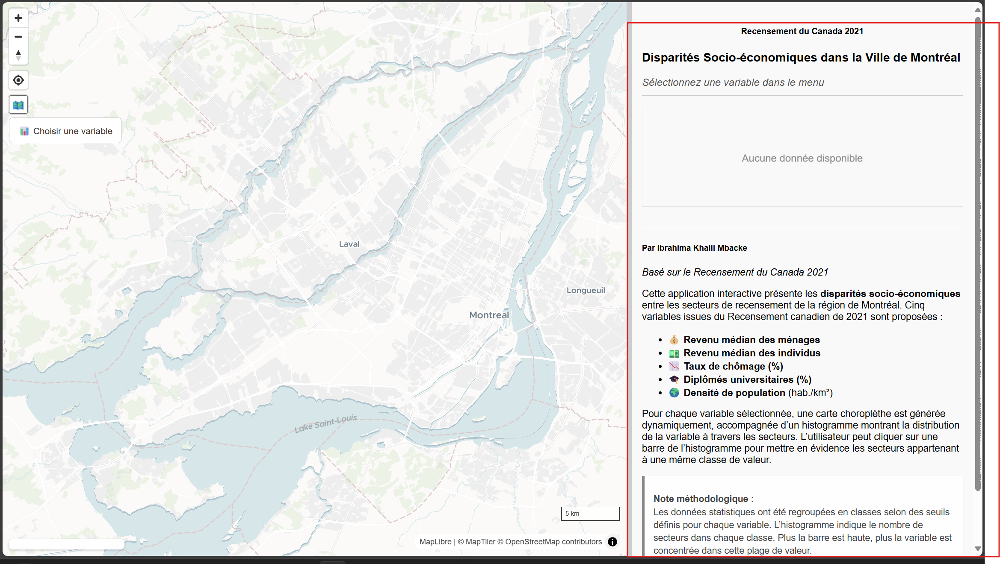
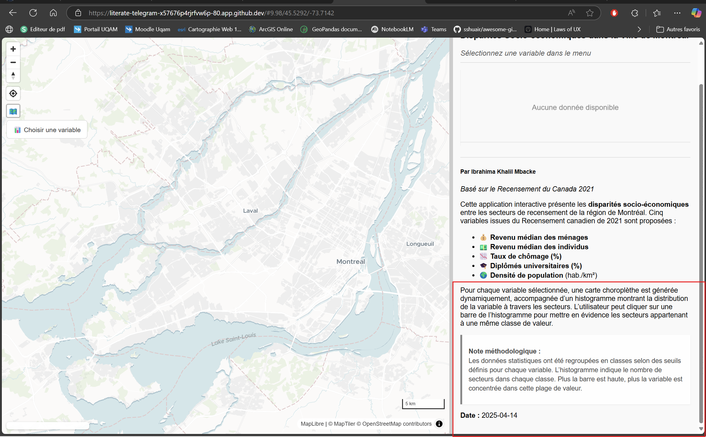
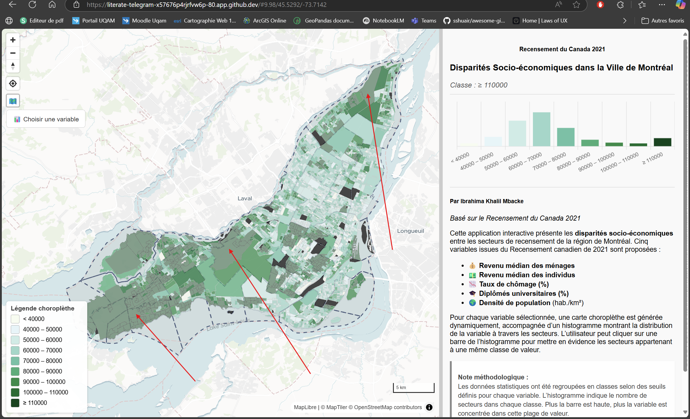

# Disparités Socio-Économiques - Équipe 1

Ce projet, réalisé dans le cadre du TP3 du cours **GEO7630** à l'UQAM, propose une application web interactive qui visualise les disparités socio-économiques à Montréal en se basant sur les données du Recensement du Canada 2021. L'application combine cartographie interactive, visualisation statistique et interface dynamique pour une exploration intuitive des inégalités spatiales.

---

## 📅 Table des matières

- [Objectifs du projet](#objectifs-du-projet)
- [Fonctionnalités](#fonctionnalités)
- [Structure du projet](#structure-du-projet)
- [Instructions d'utilisation](#instructions-dutilisation)
- [Démonstration visuelle](#démonstration-visuelle)
- [Explication du code](#explication-du-code)
- [Technologies utilisées](#technologies-utilisées)
- [Conclusion](#conclusion)

---

## 📈 Objectifs du projet

- **Visualisation interactive** : Afficher une carte dynamique avec MapLibre GL.
- **Analyse statistique** : Générer un histogramme dynamique avec Chart.js.
- **Exploration thématique** : Permettre à l'utilisateur de choisir parmi plusieurs variables via un menu déroulant.
- **Interaction utilisateur** : Mettre en surbrillance les zones selon les classes de valeurs.

---

## 🌐 Fonctionnalités

- Carte interactive avec fond vectoriel (MapTiler) et outils de navigation.
- Panneau latéral contenant :
  - Histogramme dynamique
  - Légende choroplèthe
  - Explication méthodologique
- Menu déroulant pour choisir la variable à cartographier :
  - 💰 Revenu médian des ménages
  - 💵 Revenu médian des individus
  - 📉 Taux de chômage (%)
  - 🎓 Diplômés universitaires (%)
  - 🌍 Densité de population (hab./km²)
- Interaction avec l'histogramme : clic = surbrillance sur la carte
- Bouton d'affichage/masquage de la couche des arrondissements

---

## 📁 Structure du projet

```bash
/Equipe1
├── index.html             # Structure HTML de la page
├── app.css                # Feuille de style principale
├── app.js                 # le code de js
```

---

## ⚖️ Instructions d'utilisation

### Prérequis
- Navigateur récent supportant les modules JavaScript (ES6)
- Serveur local recommandé pour lancer l'application

### Lancement
1. **Cloner le dépôt ou télécharger le projet**

2. **Servir localement** :

3. **Ouvrir dans un navigateur** 

4. **Utilisation** :
   - Choisir une variable depuis le menu
   - Interagir avec l'histogramme pour filtrer
   - Utiliser les boutons pour afficher/masquer les couches

---

## 🎨 Démonstration visuelle


### Interface principale


### La section de la présentation des données ainsi que la méthodologie




### activation de la couche des arrondissement 


### Menu déroulant (variables)


### La section de l'histogramme vide quand aucune variable n'est sélectionnée


### Sélection d'une variable pour afficher la carte 


### Interaction avec histogramme




---

## 📃 Explication du code

### Exemple : Initialisation de la carte
```js

  map = new maplibregl.Map({
    container: 'map',
    style: 'https://api.maptiler.com/maps/dataviz/style.json?key=YOUR_KEY',
    center: [-73.68, 45.55],
    zoom: 9,
    hash: true
  });
  map.addControl(new maplibregl.NavigationControl(), 'top-left');
```

### Exemple : Mise à jour de la couche choroplèthe
```js
export function updateChoropleth(variable) {
  const breaks = [10, 20, 30];
  const colors = ['#fee', '#faa', '#f00', '#800'];
  const stepExpr = ['step', ['get', variable], colors[0], ...breaks.flatMap((b, i) => [b, colors[i + 1]])];
  map.addLayer({
    id: `layer-${variable}`,
    type: 'fill',
    source: 'recensement2021',
    'source-layer': 'MBAI89260004.Stat_2021_mtl',
    paint: {
      'fill-color': stepExpr,
      'fill-opacity': 0.7
    }
  });
}
```

---

## 🚀 Technologies utilisées

- **HTML5 & CSS3** : Structure et mise en page de l'application
- **JavaScript ES6** : Programmation modulaire (import/export)
- **[MapLibre GL JS](https://maplibre.org/)** : Affichage de la carte interactive
- **[Chart.js](https://www.chartjs.org/)** : Histogrammes dynamiques
- **[Split.js](https://split.js.org/)** : Interface résizable carte/panneau

---

## 🙌 Conclusion

Ce projet illustre la construction d'une application web cartographique moderne permettant d'explorer des données socio-économiques avec une interface conviviale et réactive. L'utilisation combinée de MapLibre GL, Chart.js et d'un code modulaire en JavaScript offre une base solide pour tout projet de géovisualisation interactive.

> Projet réalisé par Ibrahima Khalil Mbacke - Équipe 1 - TP3 GEO7630 - Avril 2025

